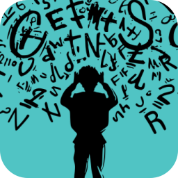
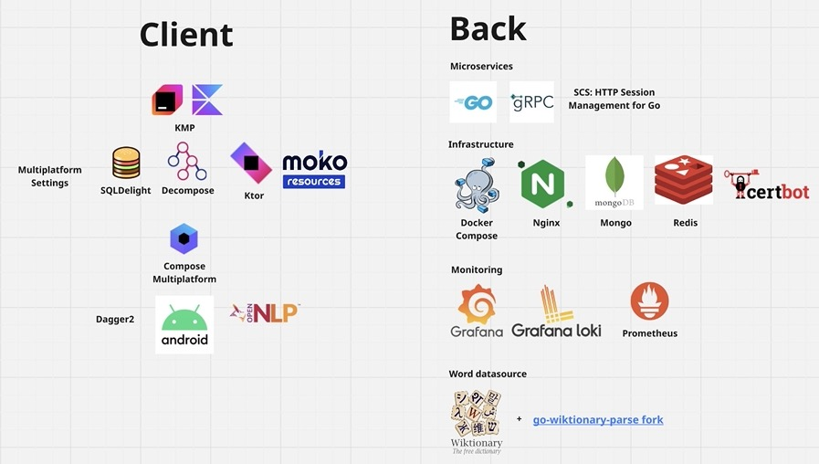
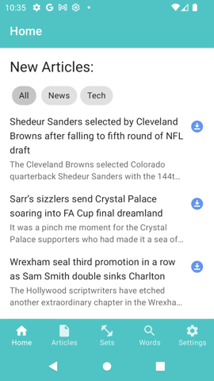
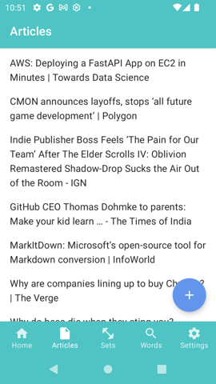

# Word Teacher

A complete solution for learning English words and phrases with spaced repetition technique. The project consists of an Android application, a desktop application, a backend component, and various tools and scripts. The repository has everything to set up all the parts yourself.

## Tech Stack

## Definitions

There're terms I use in the docs and the source code:  
* **Card** - a word or phrase with related definitions, synonyms and examples. Word Teacher tracks your learning progress for each card separately. When a word you want to start learning has different meanings, it's preferable to create a card per a meaning.  
* **Card Set** - a list of cards grouped by a topic in the title. Also a description and a source url could be set.    
* **Article** - text put in the app and proccessed with [OpenNLP](https://opennlp.apache.org/). The common way of making an article is sharing a web page to the app.  
* **Space** - Word Teacher account you can sign in. If you do, all your card sets would be stored here with constant synching between your devices. Also your shared card sets could be found by other users while searching.

## Applications

Apps are based on KMP to be able to share most of the logic between platforms. Initially I wanted to support Android and iOS. Then dropped iOS support and focused on Android and Desktop to speed up the development. Now only Android target is fully supported and Desktop will be repaired according the roadmap.

The main pattern is MVVM with UDF in mind. A ViewModel is mostly in charge of building a list of view items from available repositories. One view item represents a cell in a ui list (LazyColumn). To represent loadable data, I use [Resource](./shared/src/commonMain/kotlin/com/aglushkov/wordteacher/shared/general/resource/Resource.kt) wrapper with elementary operations/transformations: copyWith, map, updateData, isLoading, onLoaded, merge, tryInResource, loadResource and etc. So it is used all over the place. Here, Repositories are in charge of loading and storing data and providing flows for subscribing. For simple cases, I use [buildSimpleResourceRepository](./shared/src/commonMain/kotlin/com/aglushkov/wordteacher/shared/general/resource/ResourceRepository.kt#L61) builder function to create a repository from a suspended function.

Dagger2 DI is used because of its compile-time dependency checking. 

To archieve decent phrase highlight performance I implemented [Radix tree](./shared/src/commonMain/kotlin/com/aglushkov/wordteacher/shared/repository/dict/Trie.kt) data structure. Phrases and common words are stored in [words.wordlist](./android_app/src/main/res/raw/words.wordlist) and loaded in memory on launch. Their definitions are stored in Dict microservice. Hence, no offline dictionaries are needed to make phrase highlighting work, however network connecton is required. Later words.wordlist could be updated from the app and not just bundled in apk.

Each app screen is a **feature**. All the features with ViewModels are in [commonMain/features](./shared/src/commonMain/kotlin/com/aglushkov/wordteacher/shared/features). Their UI could be found in [composeSharedMain/features](./shared/src/composeSharedMain/kotlin/com/aglushkov/wordteacher/shared/features).

## Backend

The backend part is written in Go and split into microservices. The solution is completely self-hosted and could be run by anybody on their own machine. There aren't any third party API dependencies.

I use Mongo as a persistent storage. **Auth** microsevice handles client OAuth2 authorization and stores only user's network ids in users.users collection. So, here you won't find user's email, name and etc. To manage user authorization in Space, I create and store Word Teacher accessToken and refreshToken in users.authTokens collection. User sessions are stored in Redis using [scs](https://github.com/alexedwards/scs).

**Dict** microservice stores all the words from Wiktionary in wiktionary.words2 collection. To parse Wiktionary dump and fill words2 collection in structured form I  wrote my own [parser in go](https://github.com/soniccat/go-wiktionary-parse) (now it's a fork but I'm going to make it as a separate project). So you need to run it to make /api/v3/dict/words work. To implement text search I store word examples in a separate collection wiktionary.words2examples with Mongo text index. So, when you type a word or phrase /api/v2/dict/words/textsearch/ returns examples with it.

**Cardsets** microservice provides /api/cardsets/push and /api/cardsets/pull for synching (like git). Card Sets are passed as full objects every time. So, a new card set rewrites an old one. /api/cardsets/{id} returns a user's card set, allowing other users to make a copy of it without creating any references to an original one. That's done to simplify the logic and store a card progress inside of the card.

**Cardsetsearch** pulls data from Cardsets and deduplicates them to implement search logic using Mongo text index. Search results are provided in /api/cardsets/search.

**Articles** microsevice periodically pulls RSS feeds and stores headlines in headlines.headlines collection.

Now there's only one way to start all the services, and that is docker-compose file. To start it, you need to run `make up` from backend directory. 

## Main Features

### Dashboard

The source of recent news and Card Sets. They can be downloaded and stored locally from here. After using the app for some time, you'll find your recent articles and card sets to come back to them easily.

In the backend, there's a separate composition microservice [Dashboard](./backend/service_dashboard) which just pulls headlines and Card Sets from the other microservices (Articles and Cardsets), caches the data, and just provides it from /api/v1/dashboard.

### Articles

### Definitions

A screen where you can search for a word and find its definitions, examples, synonyms, and antonyms. If you add your DSL dictionaries, searching will work through them too, showing live suggestions while typing.

## Roadmap

* download the lates version of words.wordlist  
* repair Desktop version